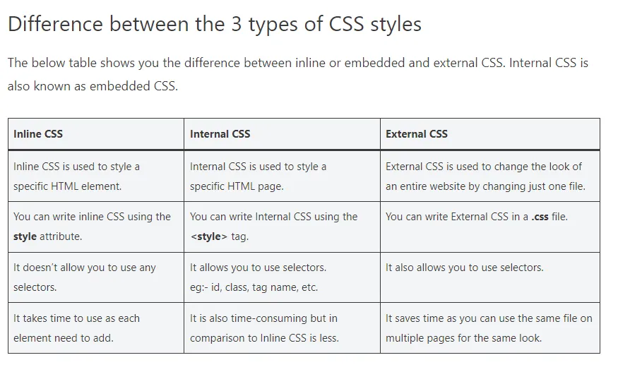
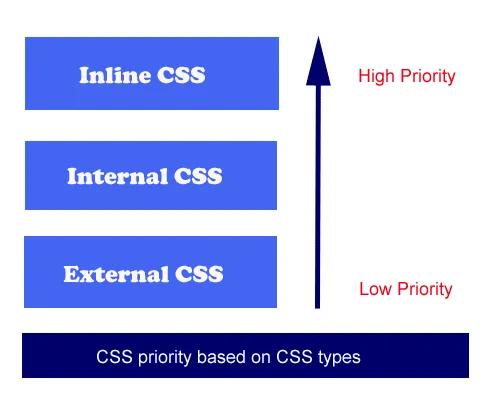

# What is CSS ? 
- **CSS is not a programming language**
- CSS stands for Cascading Style Sheets
-  CSS describes how HTML elements are to be displayed on screen, paper, or in other media
-  CSS saves a lot of work. It can control the layout of multiple web pages all at once
- External stylesheets are stored in CSS files
- Its extension is .css
* **
# How to link css file with HTML file:
```html
<head>
      <link rel="stylesheet" href="path_of_file" />
   </head>
```

# Where to write CSS 


   - Internal :
   ```html
   <html>
   <head>
      <style>
         h2 {
            background-color: red;
            color: white;
            text-align: center;
         }
         body {
            background-color: #09c;
         }
      </style>
   </head>
   <body>
     <h2>Hello World !</h2>
     <h2>Hello World !</h2>
     <h2>Hello World !</h2>
     <h2>Hello World !</h2>
   </body>
</html>
```
  - External :
  ```html
  <html>
   <head>
      <link rel="stylesheet" href="main.css"/>
   </head>
   <body>
     <h2>Hello World !</h2>
     <h2>Hello World !</h2>
     <h2>Hello World !</h2>
     <h2>Hello World !</h2>
   </body>
</html>
```
```css
h2 {
   background-color: red;
   color: white;
}
```
  -Inline :
  ```html
  <html>
   <head>
   </head>
   <body>
      <h2 style="background-color: red;">Hello World !</h2>
      <h2 style="background-color: red;">Hello World !</h2>
      <h2 style="background-color: red;">Hello World !</h2>
      <h2 style="background-color: red;">Hello World !</h2>
      <h2 style="background-color: red;">Hello World !</h2>
   </body>
</html>
```
- Priority: 

***
## Comments is CSS: 
- `/*  */`
- OR press from keyboard ctrl+?
***

## CSS syntax: 
```css
Css Rule
selector { 
	propertyName:value;
 }

Css Rule
h1 { 
	color:red;
	background-color:blue;
}
```
.webp)
***
## Classe and Id
1. Class:
- The `.class` selector selects elements with a specific class attribute.
- To select elements with a specific class, write a period (.) character, followed by the name of the class.
```css
.className {
  css declarations;
}
```
- **example 1:**
```html
<html>
   <head>
      <link rel="stylesheet" href="main.css" />
   </head>
   <body>
      <h2 class="vip">Hello World !</h2>
      <h2>Hello World !</h2>
      <h2  class="vip">Hello World !</h2>
      <h2>Hello World !</h2>
      <h2>Hello World !</h2>
      <h2>Hello World !</h2>
      <h2>Hello World !</h2>
   </body>
</html>
```
```css
h2 {
   background-color: red;
   color: white;
}

.vip {
   background-color: #09c;
}
```
***
2. Id: 
- The CSS ID selector matches an element based on the value of the element's id attribute. In order for the element to be selected, its id attribute must match exactly the value given in the selector.
```css
/* The element with id="demo" */
#demo {
  css declarations;
}
```
- **example 1:**
```html
<div id="identified">This div has a special ID on it!</div>
<div>This is just a regular div.</div>
```
```css
#identified {
  background-color: skyblue;
}
```
*** 
## Span 
- The `<span>` tag is an inline container used to mark up a part of a text, or a part of a document.
- The `<span>` tag is easily styled by CSS or manipulated with JavaScript using the class or id attribute.
- The `<span>` tag is much like the `<div`> element, but `<div>` is a block-level element and `<span>` is an inline element.
```html
<p>My mother has <span>blue</span> eyes.</p>
```
```css
span {
color:blue;
}
```
*** 
## How to reach specific element by nesting selectors 
```html
      <h2 class="test">Hello World !</h2>
      <h2>Hello World !</h2>
      <h2 class="vip">Hello World !</h2>
```
```css
h2.vip{
    color:black;
}
h2.test{
    color:red;
}
```
***
## Universal selector:
- The universal selector (*) selects all HTML elements on the page.
```css
* {
  text-align: center;
  color: blue;
}
```
*** 
## Grouping selector: 
- The grouping selector selects all the HTML elements with the same style definitions.
- Look at the following CSS code (the h1, h2, and p elements have the same style definitions)
```css
h1, h2, p {
  text-align: center;
  color: red;
}
```
## CSS font color: 
The color property is used to set the color of the text. The color is specified by:
- a color name - like "red"
- a HEX value - like "#ff0000"
- an RGB value - like "rgb(255,0,0)"
```css
body {
  color: blue;
}

h1 {
  color: green;
}
```
***
## CSS background: 
- The `background-color` property specifies the background color of an element.
```css
body {
  background-color: lightblue;
}
```
- The `opacity` property specifies the opacity/transparency of an element. It can take a value from 0.0 - 1.0. The lower value, the more transparent.
```css
div {
  background-color: green;
  opacity: 0.3;
}
```
- The `background-image` property specifies an image to use as the background of an element.
```css
body {
  background-image: url("image path");
}
```
*** 
## CSS Display:
- **inline** :Displays an element as an inline element (like <span>). Any height and width properties will have no effect. This is default.
- **block**:	Displays an element as a block element (like <p>). It starts on a new line, and takes up the whole width
- **flex**: Displays an element as a block-level flex container
- **inline-block**: Displays an element as an inline-level block container. The element itself is formatted as an inline element, but you can apply height and width values
*** 
### Text decoration 
- The `text-decoration-line` property is used to add a decoration line to text.
- The `text-decoration-color` property is used to set the color of the decoration line.
- The `text-decoration-style` property is used to set the style of the decoration line.
- The `text-decoration-thickness` property is used to set the thickness of the decoration line.
### The shorthand of text-decoration-line:
- text-decoration-line (required)
- text-decoration-color (optional)
- text-decoration-style (optional)
- text-decoration-thickness (optional)

_Note_: All links in HTML are underlined by default. Sometimes you see that links are styled with no underline. `The text-decoration: none;` is used to remove the underline from links

____
# For more information about CSS check these Resources:
[W3schools](https://www.w3schools.com/css/default.asp)
[MDN Web Docs](https://developer.mozilla.org/en-US/docs/Web/CSS)

There are CSS frameworks such as Bootstrap and tailwind, that make writing CSS easier
- Bootstrap documentation: [Booststrap](https://getbootstrap.com/docs/5.3/getting-started/introduction/)
- Tailwind documentation: [Tailwind](https://tailwindcss.com/docs/installation/framework-guides)

- Summary quick video for CSS:[CSS](https://youtu.be/Z-5QVutAEW4?si=yJdGm3comHvNq63w)

