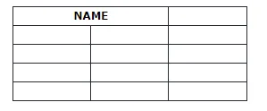
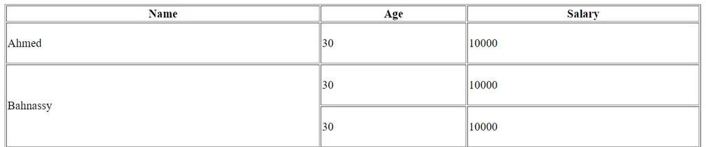

# What is HTML 
* **HTML is not a programming language** 
* It is abbreviation of Hyper Text Markup Language 
* It used to define the structure of webpage 
* **
# HTML main structure 
* File extension is .html or .htm (The entry point of any webpage)
```html
<!DOCTYPE HTML>
<html>
		<head>   </head>  not visible 
		<body>   </body>  visible 
</html>
The <html> element is the root element of an HTML page
The <head> element contains meta-information about the HTML page
The <body> element defines the document's body and is a container for all the visible contents.
```
**To make the html structure quickly from keyboard press _shift+1 then press enter_**
* **
### How to make comments in HTML ? 
```html 
<!-- This is a comment -->
```
* OR press **ctrl+?** on keyboard 
* **
## Tags 

_Nested tages_
```html
<TagName> Open Tag 
	Tag Scope 
</TagName> Close Tag
```
_Self Closed tags_
```html
<tag/>
``` 
* ** 
HTML elements are two types : Block elements and Inline elements
- **A block-level element always starts on a new line, and the browsers automatically add some space (a margin) before and after the element.**

- **A block-level element always takes up the full width available (stretches out to the left and right as far as it can).**
    - Block elements such as  
    
    - Inline elements such as  
      

* ** 
## Attributes
* All HTML elements can have attributes
* Attributes provide additional information about elements
* Attributes are always specified in the start tag
* Attributes usually come in name/value pairs like: name="value" 
**Example:**
```html
<a href="www.google.com">Google</a>
<!--href is an attribute here-->
```


### Main tags used in HTML 
1. Heading tags `<h1></h1>` till `<h6></h6>`
_h1->h6_ , they differ from each other according to their importance and **every page must have only one h1 tag**
* **
2. Paragraph tag 
```html
<p>This is a paragraph</p>
```
* **
3. Image tag 
```html

```
* **
4. Anchor tag 
```html
<a href="www.google.com">Google</a>
```
_To add links_
* **
5. Break line `<br/>`
* **
6. Horizontal line `<hr/>`
* **
7. Divisions:
- The `<div>` tag defines a division or a section in an HTML document.
- The `<div>` tag is used as a container for HTML elements - which is then styled with CSS or manipulated with JavaScript.
- The `<div>` tag is easily styled by using the class or id attribute.
```html
<html>
<head>
</head>
<body>

<div class="myDiv">
  <h2>This is a heading in a div element</h2>
  <p>This is some text in a div element.</p>
</div>

</body>
</html>
```

* **
8. Lists: 

Ordered lists: 
  ```html
  <ol>
    <li>Item 1</li>
    <li>Item 2</li>
</ol>
  ```
Unordered lists:
```html
  <ul>
    <li>Item 1</li>
    <li>Item 2</li>
  </ul>
  ```
Description lists: 
* dl —→ description list 
* dt —→ description title  
* dd —→ description data
```html
<dl>
  <dt>Coffee</dt>
  <dd>Black hot drink</dd>

  <dt>Milk</dt>
  <dd>White cold drink</dd>
</dl>
```
* **
9. Tables: 
* Table main structure is thead, tbody, tfoot
* thead and tfoof is a option 
```html 
<table border="1" width="100%" height="200">
         <tr>
            <th>Name</th>
            <th>Age</th>
            <th>Salary</th>
         </tr>

         <tr>
            <td>Ahmed</td>
            <td>30</td>
            <td>10000</td>
         </tr>

         <tr>
            <td>Bahnassy</td>
            <td>30</td>
            <td>10000</td>
         </tr>

         <tr>
            <td>Usama</td>
            <td>30</td>
            <td>10000</td>
         </tr>
      </table>
```
- **table col span --** To make a cell span over multiple columns, use the `colspan` attribute
- **Note:** The value of the `colspan` attribute represents the number of columns to span.
**example**: 

```html
<table>
  <tr>
    <th colspan="2">Name</th>
    <th>Age</th>
  </tr>
  <tr>
    <td>Jill</td>
    <td>Smith</td>
    <td>43</td>
  </tr>
  <tr>
    <td>Eve</td>
    <td>Jackson</td>
    <td>57</td>
  </tr>
</table>
```
- To make a cell span over multiple rows, use the `rowspan` attribute
- **Note:** The value of the `rowspan` attribute represents the number of rows to span.
**example:**

```html
<table border="1" width="100%" height="200">
         <thead>
            <tr>
               <th>Name</th>
               <th>Age</th>
               <th>Salary</th>
            </tr>
         </thead>

         <tbody>
            <tr>
               <td>Ahmed</td>
               <td>30</td>
               <td>10000</td>
            </tr>

            <tr>
               <td rowspan="2">Bahnassy</td>
               <td>30</td>
               <td>10000</td>
            </tr>

            <tr>
               <td>30</td>
               <td>10000</td>
            </tr>
         </tbody>
      </table>
```
* **
10.Buttons:  
- One of its common attributes is type attribute that has (submit, reset, button value)
- The default attribute of button is submit
```html
	<button type="submit"> Register </button>
	<button type="reset"> Reset </button>
	<button type="button"> Button </button>
```
* **  
11. Forms:
- **Important form attributes (action and method)**
1. **Action Attribute**:
  - The action attribute defines the action to be performed when the form is submitted.
  - Usually, the form data is sent to a file on the server when the user clicks on the submit button.
  - In the example below, the form data is sent to a file called "action_page.php". This file contains a server-side script that handles the form data:
```html 
  <form action="/action_page.php">
  <label for="fname">First name:</label><br>
  <input type="text" id="fname" name="fname" value="John"><br>
  <label for="lname">Last name:</label><br>
  <input type="text" id="lname" name="lname" value="Doe"><br><br>
  <input type="submit" value="Submit">
</form>
```
- Note: If the action attribute is omitted, the action is set to the current page.
* **
2. **Method Attribute**: 
  - The method attribute specifies the HTTP method to be used when submitting the form data.

 - The form-data can be sent as URL variables (with method="get") or as HTTP post transaction (with method="post").

- The default HTTP method when submitting form data is GET. 

_Notes on GET_:
- NEVER use GET to send sensitive data! (the submitted form data is visible in the URL!)
- The length of a URL is limited (2048 characters)
- GET is good for non-secure data, like query strings in Google 

_Notes on POST_:
- Appends the form data inside the body of the HTTP request (the submitted form data is not shown in the URL)
- POST has no size limitations, and can be used to send large amounts of data.
* **
- **Form inputs (text, number, email, pass, submit, reset,  button submit, button reset)**
    - any input has 3 attributes required (type, name , value)  but the value give by user here
    - use attribute name to contain value and send it to backend

    ```html
    <form>
	<label> FirstName </label>
	<input type="text"  name="fname"/>

	<label> LastName </label>
	<input type="text" name="lname"/>


	<label> Age </label>
	<input type="number" name="age"/>

	<label> email </label>
	<input type="email" name="email"/>


	<label> LastName </label>
	<input type="password" name="password"/>
	
	<button type="submit"> Register </button>
	<button type="reset"> Reset </button>
	<button type="button"> Button </button>
</form>

- **More attributes (placeholder,required,minlenth,maxlength,min,readonly,disabled)**
    - **readonly —→ send to backend**
    - **disabled —→ not send to backend**
    ```html
    <form>
	<label> FirstName </label>
	<input type="text"  name="fname" placeholder="Enter Your Name .... " value="usama"  disabled  required/>

	<label> LastName </label>
	<input type="text" name="lname" minlength="5"  maxlength="20"  value="ahmed menisy" readonly/>


	<label> Age </label>
	<input type="number" name="age" min="20"  max="80"/>

	
	<button disabled type="submit"> Register </button>

</form>

- **Form (textarea, file, date, color)**
```html
<form>
		<label> Comment</label>
		<textarea cols="20"  rows="2" name="comment"></textarea>
	
		<label> file </label>
		<input type="file" accept=".png" />

		<label> color</label>
		<input type="color"  />

		<label> date</label>
		<input type="date"  value="2025-01-25"  min="2020-01-01"  max="2030-12-25"/>
	
	<button type="submit"> Register </button>
</form>
```
- **Form (radio input (one choice only))**
```html
<form>
		<label> Gender </label>
		<label> female </label>
		<input type="radio" name="gender" value="female" />
		<label> male </label>
		<input type="radio" name="gender" value="female" />
</form>
```
- **Form (Checbox (A checkbox allows you to choose one or many options to be selected from a list of options.))**
```html
<form>
 <!-- Better to make checkbox have the same name (better for backend) -->           
    <input type="checkbox" name="state" id="st">
        <label for="st">Student</label>
    <input type="checkbox" name="state" id="grad.">
        <label for="grad.">Graduated</label>
            
</form>
```
- **Form (select option)**
    - Create a drop-down list with four options
```html
<form>
<label for="cars">Choose a car:</label>
<select name="cars" id="cars">
  <option value="volvo">Volvo</option>
  <option value="saab">Saab</option>
  <option value="mercedes">Mercedes</option>
  <option value="audi">Audi</option>
</select>
</form>
```

- The `<select>` element is used to create a drop-down list.
- The `name` attribute is needed to reference the form data after the form is submitted (if you omit the `name` attribute, no data from the drop-down list will be submitted).
- The `id` attribute is needed to associate the drop-down list with a label.
- The `<option>` tags inside the `<select>` element define the available options in the drop-down list.
* ** 
For more information you can visit:
[W3Schools](https://www.w3schools.com/html/) **Start with it if you are new to programming**
[MDN Web Docs](https://developer.mozilla.org/en-US/docs/Web/HTML) **For more advanced topics**

- Extensions in vs code will make coding easier and faster 🚀
   
   - Auto import 
   - Auto Rename Tag
   - Auto Close tag 
   - Image preview 
   - Live server 
   - Rainbow Tags
   - Prettier
   - IntelliSense for CSS class names in HTML (Will understand it more when CSS is explained)


