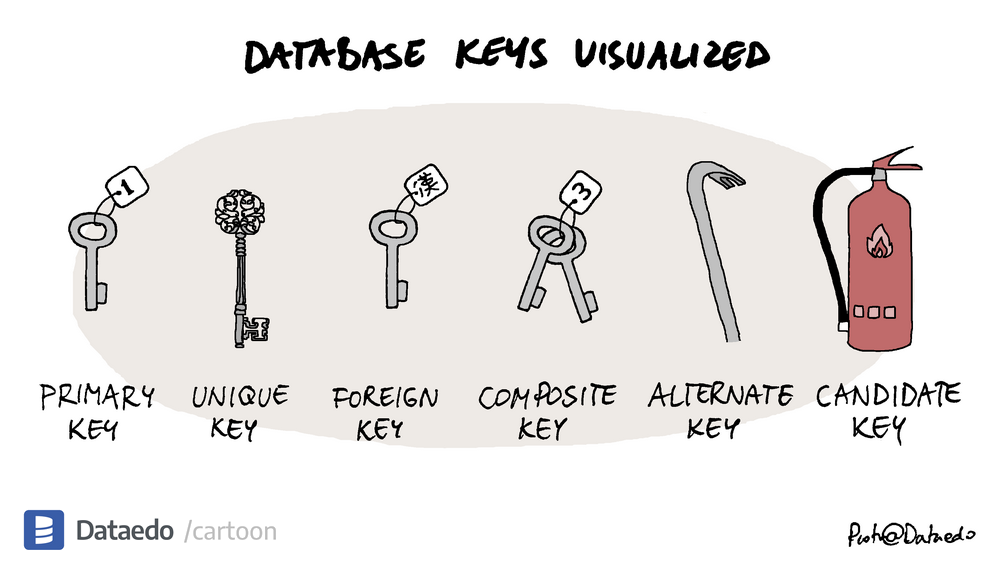

# data base keys

## what is a key?
A key is a field or set of fields that uniquely identifies a record in a table. A key is used to retrieve records from a database table according to the different access paths.

## types of keys

1. **Primary Key**: A primary key is a field in a table which uniquely identifies each row/record in a database table. Primary keys must contain unique values. A primary key column cannot have NULL values.

2. **Unique Key**: A unique key is a set of one or more fields/columns of a table that uniquely identify a record in a database table. A unique key is similar to a primary key and is used to avoid duplication of data.
3. **Super Key**: A super key is a set of one or more keys that are used to identify a record uniquely in a table. A super key may have additional attributes that are not strictly required to uniquely identify records.
4. **Candidate Key**: A candidate key is a set of one or more fields/columns that can be used as a primary key for a table. A candidate key is a super key with no repeated attributes.
5. **primary key**: A primary key is a field in a table which uniquely identifies each row/record in a database table. Primary keys must contain unique values. A primary key column cannot have NULL values.
6. **Foreign Key**: A foreign key is a field in a table that is primary key in another table. A foreign key is used to link two tables together.
7. **Composite Key**: A composite key is a combination of two or more columns in a table that can be used to uniquely identify each record in the table. A composite key is also known as a compound key.
8. **Natural Key**: A natural key is a key that is formed from the data that already exists in the database table. A natural key is sometimes called a domain key.
9. **Surrogate Key**: A surrogate key is a unique identifier for either an entity in the modeled world or an object in the database. A surrogate key is a system-generated value that is guaranteed to be unique.
10. **Alternate Key**: An alternate key is a key that can be used as a primary key. An alternate key is a candidate key that is not selected as the primary key of the table.
