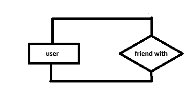
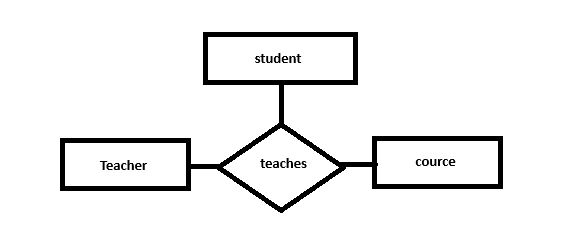

# Relations

A connection (link) between entities

Employee **works in** company

Employee ----> Entity.

Company ----> Entity.

Works in ----> Relationship between them .

## Types of Relationships in Databases:

### Unary Relationship (Degree = 1)
Relationship between the entity and itself like when **user follw user**

### binary Relationship (Degree = 2)
Relationship between 2 entity like the **Employee works in comany**

### Ternary Relationship (Degree = 3)
Relationship between 3 entities like the **Teacher Teaches course and Teaches student**

---
**Note:** 
we can have 2 entity between them more than one relationship like:
    - Employee Works in Department
    - Employee Manges Department

---
## Cardinality Ratio:
- **maximam** no. of entity instances connected by relationship
    - ether **one** or **many**

## Participation
- Descripes how an entity participates in a relationship.
    - ether **total** or **partial**
- **OR:** Does every entity instance have to participate?
    - total participartion = **Mandatory** 
    - parial participartion = **Optional**

note: if entity have to share then the minimam is **1**, if the entity did not have to share then the minimam is **0**

### possilities (for **binary** relationships):
---   
- 1:1 (one to one).
- 1:N (one to many).
- N:1 (many to one).
- M:N (many to many).

### One-to-One (1:1):
Each record in one table is associated with exactly one record in another table.

**Example 1**: Each Person has one Passport.

### One-to-Many (1:M):
A record in one table can be associated with multiple records in another table, but each record in the second table is associated with only one record in the first table.

**Example**: A customer can place many orders, but each order is placed by one customer.

### many-to-one (N:1):
Many records in one table can be associated with one record in another table. This is essentially the reverse of a one-to-many relationship.
**Example**: Many employees can belong to one department.

### Many-to-Many (M:M):
Multiple records in one table can be associated with multiple records in another table. Typically, this is represented by an intermediate table.

**Example**: Doctor can has more than one patiny, and each patiant can have many doctor.

## Cardinality & Participation
- Cardinality ---> Maximam (1 or Many)
- Paticipation ---> Minimum (0 or 1)

- how many deptments can an employee manage? 
    - Min = 0 (Partial Participartion)
    - Max = 1 (Cardinality = 1)
- how many managers can an department have?
    - Min = 1 (Total Participartion)
    - Max = 1 (Cardinality = 1)

## **References**
- [Types of Relationship in Database - GeeksforGeeks](https://www.geeksforgeeks.org/types-of-relationship-in-database/)  
- [Relationships in Database - YouTube](https://youtu.be/hp1gX4kh3lw?si=THq8Xz5dLGT-GN0J)